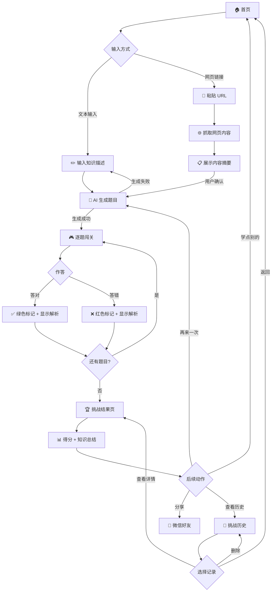

# QuestLearn PRD

> 让学习像游戏一样上瘾

---

## 1. 项目概述

QuestLearn 是一款微信小程序，用户输入想学习的任意知识（文字描述或网页链接），AI 自动生成交互式题目挑战，答题后即时反馈解析，通关生成知识总结与复盘报告，让学习过程像游戏闯关一样上瘾。

---

## 0. 原始需求依据

> **此部分为人工输入的需求原始记录，所有 PRD 内容以此为准。后续如有不确定，回看此节。**

### 核心功能 MVP（按用户操作的核心业务流程）

1. 用户可以自由输入他想学的任何知识（可以是一段话 / 一个视频 / 一个网页 / 一个文档）
2. AI 自动从网络或者特定的信息源获取知识（比如网络搜索，解析文档/视频/网站）
3. AI 生成交互式问答题目，选项和答案，通过提问引导来增加趣味性
4. 用户可以自由闯关，答题后立刻给出正确答案和解析（不管正确与否都给出）
5. 通关后生成知识总结和复盘报告，用户可以分享给好友
6. 用户可以在后台分析自己学习的知识和答题情况，可以分享给好友

### 扩展功能

1. 允许输入知识库来生成题目（RAG）：用于企业培训，特定题库
2. AI 生图，可以运用到题目和选项中：可以根据类型来自动选择是否生成，例如英语单词
3. 充值盈利的 VIP 功能
4. 多人对战比赛功能

### 已确认的决策

| 维度 | 决策 | 日期 |
|------|------|------|
| 产品名称 | QuestLearn | 2026-07-30 |
| 产品口号 | 让学习像游戏一样上瘾 | 2026-07-30 |
| 目标用户 | C 端个人学习者 | 2026-07-30 |
| 平台 | 微信小程序 | 2026-07-30 |
| 知识输入 MVP | 一段话 + 网页链接 | 2026-07-30 |
| 网页链接行为 | 抓取网页内容，提取知识点生成题目 | 2026-07-30 |
| 题型 | 选择题（单选 + 多选 + 判断） | 2026-07-30 |
| 闯关机制 | 单次挑战，做完看分数和解析 | 2026-07-30 |
| 付费模型 | MVP 完全免费 | 2026-07-30 |
| 分享 | 微信原生分享卡片（含分数摘要） | 2026-07-30 |
| 分析 | 本地挑战历史记录列表 | 2026-07-30 |

---

### 用户核心流程

---

## 2. 目标用户

| 用户画像 | 典型场景 |
|----------|----------|
| **在校学生** | 期末复习时，输入课程要点生成题目自测 |
| **自学者/终身学习者** | 读到一篇好文章，想通过做题巩固理解 |
| **备考人群** | 输入考试大纲或知识点，生成练习题快速自检 |

**核心痛点**：被动阅读留存率低，缺乏即时反馈和成就感驱动的复习方式。

---

## 3. 核心功能列表

### Must Have（MVP 必须实现）

| 编号 | 功能 | 一句话说明 |
|------|------|------------|
| M1 | 文本知识输入 | 用户输入一段文字描述想学的内容 |
| M2 | 网页链接输入 | 用户粘贴 URL，系统自动抓取网页内容 |
| M3 | AI 生成题目 | 基于输入内容自动生成一组单选/多选/判断题 |
| M4 | 答题闯关 | 用户逐题作答，即时显示对错和解析 |
| M5 | 挑战结果页 | 完成所有题目后展示得分与知识总结与复盘报告 |
| M6 | 微信分享 | 将挑战结果以卡片形式分享给微信好友 |
| M7 | 挑战历史 | 本地查看自己的历史挑战记录 |

### Should Have（MVP 后优先迭代）

| 编号 | 功能 | 一句话说明 |
|------|------|------------|
| S1 | 知识库管理 | 保存和管理已学过的知识主题，支持复用和重新挑战 |
| S2 | 难度选择 | 用户可选择题目难度（简单/中等/困难） |
| S3 | 题目数量自定义 | 用户自定义每次挑战生成的题目数量 |
| S4 | 错题本 | 自动收集错题，支持单独回顾和重新作答 |

### Nice to Have（远期规划）

| 编号 | 功能 | 一句话说明 |
|------|------|------------|
| N1 | RAG 知识库输入 | 上传文档（PDF/Word）构建专属题库，面向企业培训场景 |
| N2 | AI 生图 | 题目和选项中自动生成配图（如英语单词场景图） |
| N3 | VIP 会员 | 更高频次调用、更高级题型、去广告等增值服务 |
| N4 | 多人对战 | 实时或异步多人 PK 答题比赛 |

---

## 4. 功能详情：用户故事 & 验收标准

### M1 — 文本知识输入

**用户故事**：作为一个学习者，我想输入一段我想学的知识描述，以便系统能基于它生成练习题。

**验收标准**：
- [ ] 首页提供文本输入区域，placeholder 提示"输入你想学的知识，例如：光合作用的过程"
- [ ] 输入字数限制 6-5000 字
- [ ] 超过字数限制时实时提示并阻止提交
- [ ] 输入为空时提交按钮不可点击
- [ ] 提交后显示 loading 状态，直到题目生成完成
- [ ] 生成失败时显示友好错误提示，支持重新提交

---

### M2 — 网页链接输入

**用户故事**：作为一个学习者，我读到一篇好文章后想快速自测理解程度，所以粘贴文章链接，让系统自动提取内容生成题目。

**验收标准**：

- [ ] 输入区域支持粘贴 URL，自动识别链接格式
- [ ] URL 格式不合法时实时提示"请输入有效的网页链接"
- [ ] 提交后系统抓取网页内容，显示抓取进度
- [ ] 抓取超时（>10 秒）或失败时提示用户尝试文本输入替代
- [ ] 已抓取的内容摘要展示在确认页，允许用户确认后再生成题目

---

### M3 — AI 生成题目

**用户故事**：作为一个学习者，我希望系统根据我提交的知识自动生成一组题目，让我能通过答题来检验理解。

**验收标准**：

- [ ] 每次挑战默认生成 10 道题，包含单选题、多选题和判断题（混合）
- [ ] 判断题 2 个选项（对/错），单选/多选题 3-5 个选项
- [ ] 每道题有且仅有一个正确答案（多选时为一组正确选项组合；判断题为对或错）
- [ ] 每题附带解析说明，解释为什么正确答案是对的
- [ ] 题目内容与用户输入的知识点相关，不过于简单（照搬原文）或过于偏离
- [ ] 生成耗时超过 10 秒时显示进度提示
- [ ] 生成失败时提供重试按钮

---

### M4 — 答题闯关

**用户故事**：作为一个学习者，我想逐题作答并获得即时反馈，就像玩游戏闯关一样有成就感。

**验收标准**：
- [ ] 题目逐题展示，每次只显示一道题
- [ ] 单选题点击选项后立即判断对错（绿色=正确，红色=错误，同时高亮正确答案）
- [ ] 多选题点击"确认"按钮后判断对错，逻辑同上
- [ ] 判断题点击"对/错"后立即判断对错，逻辑同单选
- [ ] 无论答对答错，均显示题目解析
- [ ] 显示当前进度（如 3/10）
- [ ] 点击"下一题"进入后续题目，不可回退修改已答题目
- [ ] 每题作答后立即计入分数，页面不刷新

---

### M5 — 挑战结果页

**用户故事**：作为一个学习者，做完题后我想看到我的成绩和本次学习的知识总结与复盘报告，以便了解掌握情况。

**验收标准**：
- [ ] 展示总得分（如 8/10，80%）
- [ ] 显示答对/答错统计
- [ ] 展示本次学习的知识总结与复盘报告（AI 基于题目生成，3-5 个要点）
- [ ] 支持查看每道题的作答记录（选了哪个、正确答案是什么、解析）
- [ ] 底部提供"再来一次"按钮，基于同一知识重新生成一组题
- [ ] 底部提供"学点别的"按钮，返回首页

---

### M6 — 微信分享

**用户故事**：作为一个学习者，我考了高分想跟朋友炫耀，或者觉得某个知识点有意思想分享出去。

**验收标准**：
- [ ] 结果页点击"分享"按钮，触发微信原生分享
- [ ] 分享卡片标题：我在 QuestLearn 挑战了「{知识主题}」，得分 {X}/{Y}
- [ ] 被分享者点击卡片进入小程序首页（分享卡片本身含分数摘要，无需登录）
- [ ] 无网络或分享失败时提示"分享失败，请重试"

---

### M7 — 挑战历史

**用户故事**：作为一个学习者，我想回顾之前的挑战记录，看看自己都学了什么、表现如何。

**验收标准**：
- [ ] 首页或独立 Tab 中可进入"历史记录"列表
- [ ] 每条记录显示：知识主题、得分、题目数量、挑战时间
- [ ] 按时间倒序排列
- [ ] 点击某条记录可查看该次挑战的完整详情（题目、作答、解析）
- [ ] 支持左滑删除单条记录
- [ ] 支持分享单条历史记录给微信好友（卡片含知识主题与得分摘要）
- [ ] 历史记录存储在本地，卸载小程序后清除

---

### S1 — 知识库管理（Should Have）

**用户故事**：作为一个学习者，我想保存我学过的知识主题，方便以后复习和重新挑战。

**验收标准**：
- [ ] 从挑战结果页可将当前知识主题保存到"我的知识库"
- [ ] 知识库列表展示主题名称、保存时间、已挑战次数
- [ ] 点击任一主题可直接发起新挑战
- [ ] 支持删除知识库中的主题
- [ ] 知识库数据本地存储，与挑战历史一致（卸载清除）

---

### S2 — 难度选择（Should Have）

**用户故事**：作为一个学习者，我想根据自己对知识的掌握程度选择题目难度。

**验收标准**：
- [ ] 生成题目前提供难度选项：简单/中等/困难
- [ ] 简单：偏基础概念和记忆
- [ ] 中等：偏理解和应用
- [ ] 困难：偏分析和综合推理
- [ ] 默认为中等

---

### S3 — 题目数量自定义（Should Have）

**用户故事**：作为一个学习者，我想控制每次挑战的题目数量。

**验收标准**：
- [ ] 生成题目前提供数量选项：3 / 5 / 10 / 15 / 20
- [ ] 默认 10 题
- [ ] 选择更多题目时提示"生成可能需要更长时间"

---

### S4 — 错题本（Should Have）

**用户故事**：作为一个学习者，我想集中回顾我做错的题目，针对性补强薄弱环节。

**验收标准**：
- [ ] 所有答错的题目自动加入错题本
- [ ] 错题本按知识主题分组展示
- [ ] 点击某道错题可查看题目、我的错误答案、正确答案和解析
- [ ] 支持从错题本直接发起"错题重做"挑战
- [ ] 重新做对的题目自动从错题本移除

---

### N1-N4（Nice to Have）

用户故事与验收标准留待后续版本规划时细化。

---

## 5. 非功能需求

### 性能

| 指标 | 要求 |
|------|------|
| 小程序冷启动时间 | < 3 秒 |
| 页面切换响应 | < 500ms |
| AI 题目生成耗时 | 用户提交后 15 秒内完成（含网页抓取时间） |
| 答题交互响应 | < 200ms（选选项→显示结果） |
| 小程序包体积 | < 2MB |

### 安全

| 要求 | 说明 |
|------|------|
| 数据传输加密 | 所有 API 请求使用 HTTPS |
| 用户输入过滤 | 防止 XSS、SQL 注入，文本输入做敏感词过滤 |
| 隐私合规 | 遵循微信小程序隐私政策，用户数据采集最小化 |
| 网页抓取安全 | 过滤恶意 URL（内网地址、file:// 协议等），抓取内容做安全检查 |
| 内容审核 | AI 生成的题目和解析内容需符合内容安全规范，不含违规信息 |

### 兼容性

| 要求 | 说明 |
|------|------|
| 微信版本 | 支持微信 8.0 及以上版本 |
| 系统版本 | iOS 14+ / Android 8.0+ |
| 屏幕适配 | 适配主流手机屏幕尺寸（375px - 428px 宽度） |
| 网络环境 | 支持 Wi-Fi、4G/5G，弱网环境下降级可用（非生成类操作可离线完成） |

---

*文档版本：v1.0 | 最后更新：2026-07-30*
