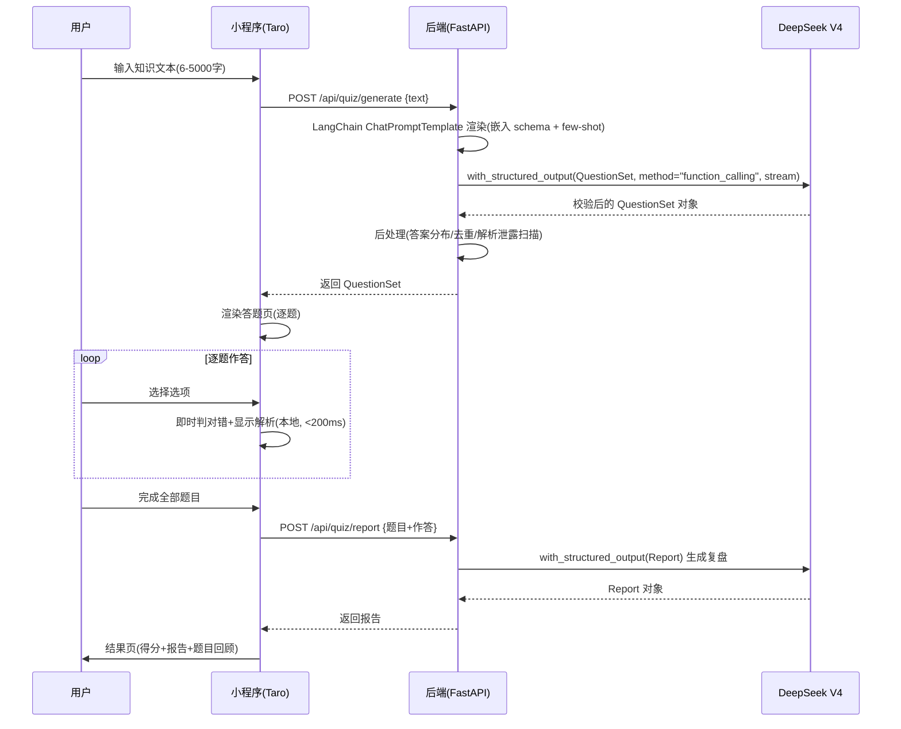

# QuestLearn 方案设计文档

> 让学习像游戏一样上瘾

| 项 | 值 |
|---|---|
| 文档版本 | v1.2 |
| 最后更新 | 2026-07-30 |
| 关联文档 | [PRD.md](./PRD.md) |
| 技术栈 | 与用户给定完全一致 |

---

## 1. 项目概述与目标

### 1.1 项目定位

QuestLearn 是一款微信小程序：用户输入想学的知识（一段话或网页链接），AI 自动生成交互式题目（单选/多选/判断），用户逐题闯关并获得即时解析，通关后生成知识总结与复盘报告，可分享给微信好友。

核心价值：把被动阅读变成游戏化闯关，用即时反馈和成就感驱动复习留存。

### 1.2 MVP 范围与分步策略

按用户要求，**分步骤实现，先跑通核心业务流程**（输入 → 生成题目 → 答题 → 生成报告），上来不考虑数据库、不考虑微信主体合规、不考虑部署形态。分步如下：

| 阶段 | 范围 | 目标 |
|---|---|---|
| **P0（当前优先）** | M1 文本输入 + M3 生成题目 + M4 答题闯关 + M5 结果报告 | 纯文本链路端到端跑通 AI 编排 |
| **P1** | M2 网页链接抓取 | 扩展知识输入源 |
| **P2** | M6 微信分享 + M7 挑战历史 | 社交传播 + 本地回看 |
| **P3** | S1-S4 知识库/难度/数量/错题本 | 体验增强 |
| **P4** | N1-N4 RAG/AI 生图/VIP/对战 | 远期商业化 |

---

## 2. 总体架构

### 2.1 分层架构

```
┌─────────────────────────────────────────────┐
│  微信小程序（Taro 4.x + React 18 + TS）       │
│  首页 / 答题页 / 结果页 / 历史页              │
│  本地存储（挑战历史）  微信分享               │
└───────────────┬─────────────────────────────┘
                │ HTTPS（已备案域名）
┌───────────────▼─────────────────────────────┐
│  后端（FastAPI + Python 3.11）                │
│  /api/quiz/generate  生成题目                │
│  /api/quiz/report    生成复盘报告            │
│  /api/extract        网页抓取（P1）          │
│  LangChain（模板化 + 输出约束） + Pydantic v2 │
└───────┬───────────────────┬─────────────────┘
        │                   │
        ▼                   ▼
┌──────────────┐    ┌──────────────────────┐
│ DeepSeek API │    │ 目标网页（用户粘贴） │
│ deepseek-    │    │ httpx + trafilatura  │
│ v4-flash     │    │ + SSRF 防护          │
└──────────────┘    └──────────────────────┘
```

### 2.2 核心链路时序（P0）



---

## 3. 技术选型

> 技术栈与用户给定完全一致。额外引入的辅助库（tenacity / httpx / trafilatura）在 3.6 说明原因。

### 3.1 小程序框架选型

采纳 **Taro 4.x + React 18 + TypeScript**（与用户选型一致）。

**理由**：
1. React 技术栈约束下的最优解——uni-app/Mpx 是 Vue 栈，Remax/mpvue 已停更（Remax 2.15.14 自 2022 实质停更，mpvue 为 legacy）。
2. 真实活跃：Taro `@tarojs/taro` 最新 4.2.1（2026-07-17 发布），npm 1193 个版本，月度迭代。
3. React 18 官方适配（`docs.taro.zone/docs/react-18`，Taro 3.5 起接入 createRoot/Suspense）——选 React 18 与 Taro 核心依赖完全对齐。
4. H5 扩展成本最低（同一套 React 代码），为未来留出口。

#### 采纳 Taro 必须立项即做的 5 项工程纪律

这是"Taro 是否最优"能否兑现的关键，不做必踩坑：

1. **锁死 React 18**：`package.json` 固定 `react@^18` / `react-dom@^18`，引入任何第三方库前查 peerDeps，规避 React 19 类型冲突（GitHub `jd-opensource/taro-ui#1840`：taro-ui 3.x 强制 React 19 类型，与 Taro 4.x 依赖的 React 18 冲突导致构建失败）。
2. **立项即规划分包**：主包只放首页，答题页/报告页/历史页放分包，配 `mini-split-chunks-plugin` 智能提取分包依赖，图片走 CDN。这是 <2MB 硬约束的生命线（GitHub `NervJS/taro#11349`/`#12046`：vendors.js 膨胀致无法上传）。
3. **答题页用 CompileMode + Skyline**：`experimental.compileMode: true` + Skyline worklet（Taro 4.0.8 起支持）处理答题交互动画，确保 <200ms 响应；不可用页面降级 WebView 保证兼容。
4. **TS 严格模式 + props 引用稳定**：对基础组件 props 用 `useMemo`/`useRef` 稳定引用，避免内联对象/数组每次渲染触发无谓 setData。
5. **UI 选型**：优先自定义轻量组件，MVP 不引入过重 UI 框架（与用户 UI 策略一致）；如个别复杂组件确有需要，再按需评估 NutUI React Taro 版等轻量组件库。

### 3.2 前端技术栈

与用户给定一致：

| 层 | 选型 | 说明 |
|---|---|---|
| 框架 | Taro 4.x | 跨端编译到微信小程序 |
| 视图库 | React 18 | 与 Taro 核心依赖对齐，锁版本 |
| 语言 | TypeScript | strict 模式（见 3.1 工程纪律第 4 条） |
| 状态管理 | Zustand 或页面内状态（轻量优先） | 挑战进行中用 Zustand 持有当前题目集与作答，简单页用页面内状态 |
| 请求层 | 基于 `Taro.request` 的统一封装 | 统一 baseURL/超时/loading/错误处理 |
| UI 策略 | 优先自定义轻量组件 | MVP 不引入过重 UI 框架（与用户一致） |
| 构建 | Taro CLI + VSCode + 微信开发者工具 | |

### 3.3 后端技术栈

与用户给定一致：

| 层 | 选型 | 说明 |
|---|---|---|
| Web 框架 | FastAPI | 自动文档、async 原生支持流式 |
| 运行环境 | Python 3.11+ | |
| 数据校验 | Pydantic v2 | 题目 schema + 校验 AI 输出 |
| HTTP 客户端 | OpenAI SDK（兼容 DeepSeek） | base_url=`https://api.deepseek.com` |
| Prompt 编排 | **LangChain**（仅模板化 + 输出约束，不做重型 Agent） | ChatPromptTemplate 模板化 + with_structured_output 输出约束，见 3.3.1 |
| 配置管理 | pydantic-settings | 管理环境变量与密钥 |
| 日志 | structlog | 结构化日志（与"标准 logging"二选一，选 structlog 因 FastAPI 异步场景结构化日志更利于排障） |
| 测试 | pytest | |

### 3.3.1 LangChain 使用方式（仅模板化 + 输出约束）

严格遵循用户"LangChain 仅用于模板化和输出约束，不做重型 Agent 化"的定位，只用到 LangChain 的两个能力，不引入 Chain/Agent/Memory 等重型抽象：

**能力一：模板化（ChatPromptTemplate）**

用 `ChatPromptTemplate.from_messages` 组织 system/user 消息，嵌入 schema 与 few-shot，替代手写 f-string/Jinja2。变量注入、消息角色、few-shot 拼接都走 LangChain 原生。

```python
from langchain_core.prompts import ChatPromptTemplate

prompt = ChatPromptTemplate.from_messages([
    ("system", "你是学科教研专家……输出严格 JSON，符合给定 schema……"),
    ("user", "# 知识文本\n{knowledge_text}\n\n# schema\n{schema}\n\n# 示例\n{few_shot}\n\n请输出 JSON。"),
])
```

**能力二：输出约束（with_structured_output）**

DeepSeek 官方支持 **Tool Calls**（function calling），通过 `with_structured_output(QuestionSet, method="function_calling")` 把 schema 作为 tool 下发，LangChain 直接返回**校验后的 Pydantic 对象**，省去手写 `json.loads` + `model_validate`。DeepSeek 官方未提供 OpenAI 风格的 `response_format json_schema`（见 [api-docs.deepseek.com/guides/tool_calls](https://api-docs.deepseek.com/guides/tool_calls/)），故不走 `method="json_schema"`。

```python
from langchain_openai import ChatOpenAI

llm = ChatOpenAI(
    base_url="https://api.deepseek.com",
    model="deepseek-v4-flash",
    api_key=settings.deepseek_api_key,
)
structured_llm = llm.with_structured_output(QuestionSet, method="function_calling")
chain = prompt | structured_llm
result: QuestionSet = chain.invoke({"knowledge_text": ..., "schema": ..., "few_shot": ...})
```

> `with_structured_output` 的 `method` 参数：`function_calling`（默认，DeepSeek 官方支持）/ `json_mode`（`response_format json_object`，需手写校验）/ `json_schema`（DeepSeek 不适用）。如需服务端强 schema 校验，启用 Tool Calls `strict` 模式（Beta，`base_url=.../beta` + tool `strict:true`）；P0 用普通 function_calling + 后处理校验（4.4.3）兜底，不强依赖 strict beta。

**不做的**：不引入 LangChain Agent / Chain 编排复杂业务流 / Memory 会话记忆 / RAG 检索链。题目生成与复盘报告都是"单次 prompt → 单次结构化输出"，无多步推理需求。

### 3.4 AI 大模型选型

采纳用户给定模型：

- **首选 `deepseek-v4-flash`**：题目生成是结构化输出场景，flash 便宜、并发高、速度足够，用 **non-thinking 模式**优先保证 15 秒内出题。
- **次选 `deepseek-v4-pro`**：复杂知识或复盘报告需更强推理时用 pro + thinking 模式，成本更高、并发低，仅作为困难场景降级。

关键特性：
- **OpenAI SDK 兼容**：`base_url=https://api.deepseek.com`，模型名直接传 `deepseek-v4-flash`。
- **支持 Tool Calls（function calling）**：配合 LangChain `with_structured_output(method="function_calling")`，见 4.3；另 `strict` 模式（Beta）服务端校验 schema。
- **已备案**：DeepSeek（杭州深度求索）已完成网信办《生成式人工智能服务》备案 +《深度合成服务算法》备案，属已备案国内第三方大模型。

### 3.5 数据存储

按用户要求"上来不需要想数据库的问题"：

| 数据 | P0-P2 方案 |
|---|---|
| 题目集（生成结果） | 后端**无状态**，不落库，直接返回前端，前端持有至答题完成 |
| 答题记录 | 答题过程纯前端本地完成，不持久化 |
| 挑战历史（M7） | 前端微信 storage 本地存（PRD 已定：本地、卸载清除），见 6.2 |
| 复盘报告 | 随结果页展示，可选存入本地历史 |

后端 P0-P2 完全无状态、不引入数据库。远期若 S1 知识库云端化 / 用户体系等功能需要持久化，届时再选型（不在当前范围）。

### 3.6 额外辅助库说明（用户技术栈表未列）

以下库不在用户给定技术栈表内，但开发必需，说明引入原因：

| 库 | 用途 | 引入原因 |
|---|---|---|
| tenacity | 重试 | LangChain 内置重试不区分类型；业务层需区分"限流退避重试"（max 3 次指数退避）与"JSON 修复重试"（max 1 次改 prompt），用 tenacity 精细控制（见 4.5） |
| httpx | 网页抓取 HTTP 客户端（P1） | 用户技术栈表的"HTTP 客户端 OpenAI SDK"是调 DeepSeek 用的；P1 抓取网页需独立的 async HTTP 客户端，httpx 是 FastAPI 生态首选 |
| trafilatura | 网页正文提取（P1） | 抓取后提取正文去噪喂给 LLM，trafilatura 2.1.0 在多公开基准最优，见 5.2 |

不引入 Jinja2：模板化走 LangChain ChatPromptTemplate，无需独立模板引擎。

---

## 4. 核心业务流程设计

### 4.1 AI 题目生成架构

```
用户输入知识文本
    ↓
[FastAPI] /api/quiz/generate
    ↓
LangChain ChatPromptTemplate 渲染（嵌入 QuestionSet schema + few-shot）
    ↓
LangChain ChatOpenAI(base_url=deepseek, model=deepseek-v4-flash)
    .with_structured_output(QuestionSet, method="function_calling")   # 返回校验后对象
    ↓
后处理校验（答案分布/选项去重/解析泄露正则扫描）
    ↓ 失败
tenacity 修复重试（把错误拼回 prompt，max 1 次）
    ↓ 成功
返回前端 QuestionSet
    ↓ 用户答题
/api/quiz/report：同样 prompt | with_structured_output(Report) 流程
```

### 4.2 题目数据模型（Pydantic v2）

三种题型统一表示，`answer` 统一为 `list[str]`，答题判定逻辑统一为 `set(user_answer) == set(question.answer)`，避免三套并行代码。

```python
from pydantic import BaseModel, Field, field_validator
from typing import Literal

class Option(BaseModel):
    label: Literal["A", "B", "C", "D", "T", "F"]  # T/F 用于判断题
    content: str

class Question(BaseModel):
    id: int = Field(ge=0)
    type: Literal["single", "multiple", "judge"]
    knowledge_point: str
    difficulty: Literal["easy", "medium", "hard"]
    stem: str
    options: list[Option]
    answer: list[str]  # 正确选项 label 集合（单选/判断长度 1，多选≥2）
    explanation: str  # 题目解析；不得泄露正确答案（后处理正则扫描兜底）

    @field_validator("options")
    @classmethod
    def check_options(cls, v, info):
        t = info.data.get("type")
        labels = [o.label for o in v]
        if len(labels) != len(set(labels)):
            raise ValueError("选项 label 不可重复")
        if t == "judge":
            if len(v) != 2:
                raise ValueError("判断题必须有 2 个选项")
            if set(labels) != {"T", "F"}:
                raise ValueError("判断题选项必须为 T/F")
        if t in ("single", "multiple"):
            if len(v) < 2:
                raise ValueError("选择题至少 2 个选项")
            if not set(labels).issubset({"A", "B", "C", "D"}):
                raise ValueError("选择题选项须用 A-D")
        return v

    @field_validator("answer")
    @classmethod
    def check_answer(cls, v, info):
        labels = {o.label for o in info.data.get("options", [])}
        if not set(v).issubset(labels):
            raise ValueError("answer 引用了不存在的选项")
        t = info.data.get("type")
        if t in ("single", "judge") and len(v) != 1:
            raise ValueError("单选/判断题答案必须唯一")
        if t == "multiple" and len(v) < 2:
            raise ValueError("多选题答案至少 2 个")
        return v

class QuestionSet(BaseModel):
    questions: list[Question]

    @field_validator("questions")
    @classmethod
    def check_composition(cls, v):
        # P0 默认 10 题：6 单选 + 2 多选 + 2 判断（S3 题目数量自定义后再放宽）
        if len(v) != 10:
            raise ValueError("P0 默认生成 10 道题")
        types = [q.type for q in v]
        if not (types.count("single") == 6 and types.count("multiple") == 2 and types.count("judge") == 2):
            raise ValueError("题型分布须为 6 单选 + 2 多选 + 2 判断")
        if len({q.id for q in v}) != len(v):
            raise ValueError("题目 id 不可重复")
        return v

class Report(BaseModel):
    summary: list[str]  # 3-5 个复习要点
    weak_points: list[str]  # 薄弱知识点
    suggestions: list[str]  # 复习建议

    @field_validator("summary")
    @classmethod
    def check_summary(cls, v):
        if not (3 <= len(v) <= 5):
            raise ValueError("summary 须 3-5 个要点")
        return v
```

**设计要点**：
- `answer` 统一 `list[str]`：三种题型判定逻辑一致，不分流。
- `label` 用 `Literal` 而非自由 `str`：防模型输出 "a"/"A"/"甲" 等不一致。
- 跨字段校验用 `field_validator` 读 `info.data`，Pydantic v2 原生支持。
- 顶层 `QuestionSet` 而非裸 `list`：便于将来加 `session_id`、`version`、`stats` 等元数据。
- schema 直接用 `QuestionSet.model_json_schema()` dump 进 prompt，比手写描述可靠。

### 4.3 结构化输出方案

| 方案 | DeepSeek V4 可用 | Schema 强制 | 选用 |
|---|---|---|---|
| function/tool calling | ✓ | 中（tool schema 约束） | **采用**（LangChain `with_structured_output` 默认 method） |
| tool calling `strict` 模式（Beta） | ✓（需 `base_url=.../beta`） | 强（服务端校验 schema） | 备选（需 strict 时启用） |
| `json_object`（JSON mode） | ✓ | 弱（只保证合法 JSON） | 备选（method="json_mode"，需手写 `model_validate`） |
| `json_schema`（OpenAI response_format） | ✗（DeepSeek 无此 response_format） | — | 不适用 |

**采用方案**：LangChain `with_structured_output(QuestionSet, method="function_calling")`——DeepSeek 官方支持 Tool Calls，LangChain 以 tool 形式下发 schema，模型按 schema 输出并返回校验后的 Pydantic 对象，无需手写 `json.loads` + `model_validate`。

**注意**：DeepSeek 官方未提供 OpenAI 风格 `response_format={'type':'json_schema'}`；结构化强约束走 Tool Calls `strict` 模式（Beta）。P0 用普通 function_calling + 后处理校验兜底（4.4.3），不强依赖 strict beta。

**约束**：function_calling 模式下 prompt 仍建议内嵌 schema 示例引导；若改用 json_mode 则 prompt 必须含 "json" 字样（DeepSeek JSON 模式约束）。

### 4.4 Prompt 工程

#### 4.4.1 题目生成 prompt 结构（ChatPromptTemplate）

```
[SYSTEM] 角色：学科教研专家，熟悉布鲁姆认知层级。
任务：基于给定知识生成测验题。输出严格 JSON，符合给定 schema。
正确答案位置随机分布。干扰项需似是而非（同类别/同量级/常见误解）。
负面约束：不得照搬原文原句、解析不得泄露正确答案、选项不得语义雷同、不得引入知识文本外信息。

[USER]
# 知识文本
{knowledge_text}

# 题目规格
- 题数：10（6 单选 + 2 多选 + 2 判断）
- 难度：易 3 / 中 5 / 难 2
- 每题字段：id, type, knowledge_point, difficulty, stem, options[{label,content}], answer[list], explanation

# 输出 schema（JSON）
{QuestionSet.model_json_schema()}

# 示例（few-shot，1 正 1 反，反例标注"错误：解析泄露答案"）
{few_shot_examples}

请输出 JSON。
```

#### 4.4.2 复盘报告 prompt 结构

```
[SYSTEM] 角色：学习导师。基于用户答题表现生成个性化复习报告。
输出：JSON，含 summary（3-5 要点）+ weak_points（薄弱知识点）+ suggestions（复习建议）。

[USER]
# 题目与作答
{questions_with_user_answers}  # 每题：题干/正确答案/用户答案/对错

# 用户总体表现
正确率：{correct}/{total}
薄弱题型：{weak_types}

请输出 JSON。
```

#### 4.4.3 质量保证（不靠模型自觉，代码层兜底）

`with_structured_output` 保证 schema 合法，但保证不了题目"质量"——后处理校验函数，失败即 tenacity 重试：
- 正确答案索引分布检查（10 题答案全在 A → 触发重试）
- 同题选项文本去重（不允许重复）
- 解析中是否出现"正确答案是"等泄露短语（正则扫描）
- 判断题必须只有 2 个选项
- 题干不得与原文原句完全相同

### 4.5 错误处理与重试

| 错误类型 | 可重试 | 策略 |
|---|---|---|
| 网络超时 | 是 | tenacity 指数退避，max 3 次 |
| 限流（429） | 是 | 退避 + jitter，读 Retry-After |
| 空内容（JSON 模式已知偶发） | 是 | 改写 prompt 后重试 |
| Pydantic 校验失败 | 是（1 次） | 把 ValidationError 拼回 prompt 修复 |
| 400（缺 "json" 关键字） | 否 | 修 prompt，不重试 |
| 401/403 鉴权 | 否 | 报警，不重试 |

- **修复型重试**（校验失败）与**退避型重试**（限流/超时）分开：前者只重 1 次且改 prompt，后者最多 3 次且退避。
- 客户端 `timeout=30s`，P0 单次调用保 15 秒内完成（PRD 非功能）；超时降级分批（2×5 题并发）属非核心性能容灾，移至 P1，P0 不实现。

---

## 5. 网页抓取方案（P1）

### 5.1 前端不能直接抓取

微信小程序网络是封闭白名单制：`wx.request` 只能调预先配置的已备案 HTTPS 域名。用户粘贴的任意 URL 绝无可能在前端直接请求——**必须后端抓取**。这也正好满足"抓取内容摘要给用户确认后再生成"的流程：后端抓取 → 返回摘要 → 前端确认 → 调生成接口。

### 5.2 正文提取库选型

| 库 | 版本 | 定位 | 选用 |
|---|---|---|---|
| trafilatura | 2.1.0（2026-06） | 全流程：正文+元数据，jusText+readability 双算法，多基准最优 | **采用** |
| readability-lxml | 0.8.4 | 单一正文+标题 | 兜底备用 |

链路：`httpx.get → trafilatura.extract(html, output_format='markdown', include_comments=False) → 截断到 8000 字 → 喂给 LLM`。

### 5.3 SPA 动态渲染页面

- 绝大多数学习类内容（博客/百科/新闻/文档站）是 SSR，trafilatura 直接可取。
- 提取结果为空/过短时，提示用户"该页面可能动态渲染，请改用文本输入"。
- MVP **不引入 Playwright**（Chromium 200MB+，重量级，启动慢、内存高）；远期确有必要再按需引入。

### 5.4 SSRF 防护（必做）

用户可控 URL 是经典 SSRF 入口，必须覆盖：

1. **协议白名单**：只允许 `http`/`https`，拒绝 `file://`/`gopher://`/`dict://`/`ftp://`。
2. **内网 IP 段过滤**（5 段 + IPv6）：
   - `127.0.0.0/8`（整个 127 段，不止 127.0.0.1）
   - `10.0.0.0/8`、`172.16.0.0/12`（172.16-172.31）、`192.168.0.0/16`、`0.0.0.0/8`
   - `169.254.0.0/16`（链路本地）、`::1`、`fc00::/7`（IPv6 私有）
3. **DNS 解析后检查**：不能只看 hostname 字符串（攻击者可配 A 记录指向内网），必须 `socket.getaddrinfo` 解析出真实 IP 后用 `ipaddress.ip_address(ip).is_private` 判断。
4. **重定向检查**：`follow_redirects=False`，手动处理每一跳的 location 并重新做完整 SSRF 检查。
5. **超时**：连接+读取各 5s，总 10s（符合 PRD）。
6. **内容长度**：响应体上限 2MB，超出截断或拒绝。
7. **Content-Type 检查**：只接受 `text/html`/`application/xhtml+xml`/`text/plain`。

---

## 6. 微信小程序技术方案

### 6.1 包体积 <2MB 优化

1. **分包加载**：主包只放首页，挑战页/生成页/报告页/历史页放分包。
2. **`mini-split-chunks-plugin`**：智能提取多分包共享依赖到各自 `sub-common`，避免重复打包撑大主包。
3. **图片资源**：icon 用字体图标/SVG，大图走 CDN，启用压缩。
4. **vendor 拆分**：第三方大库按需引入、动态 import。
5. **依赖分析**：开发者工具 → 详情 → 基本信息 → 本地代码，针对性优化。

### 6.2 本地存储（挑战历史 M7）

微信 storage 限制：单 key 1MB / 总 10MB（同一用户同一个小程序）。卸载小程序时微信会清理其 storage（系统保证，开发者无需额外处理）。

挑战历史数据控制策略：
- **分 key 存储**：按挑战 ID 分散（`challenge_{id}`），每个 <1MB。
- **摘要 + 详情分离**：列表页只存摘要（主题/得分/时间/题数），详情按需加载。
- **条数上限**：保留最近 50 条，旧的滚动淘汰。
- **裁剪**：只存题干+选项+用户答案+对错，不存完整解析。
- **兜底**：写入失败（超 10MB）捕获 `fail`，提示清理或自动删最旧记录。
- **加密**：含用户作答建议 `encrypt: true`。

### 6.3 微信分享（M6）

- `onShareAppMessage`：页面级，转发到朋友/群，返回 `{title, path, imageUrl}`。
- `onShareTimeline`：分享到朋友圈（前提：页面先允许"发送给朋友"）。
- 动态分享图（带分数）：Canvas 绘制后取临时文件路径，或后端生成图片返回。
- 卡片标题格式：「我在 QuestLearn 挑战了「{知识主题}」，得分 {X}/{Y}」。

### 6.4 隐私政策

- 必须配置《小程序用户隐私保护指引》（管理后台-设置-服务内容声明）。
- 官方隐私弹窗（2023-10-17 起平台提供统一设计，无需开发者适配）。
- `wx.onNeedPrivacyAuthorization` 监听授权事件，`wx.requirePrivacyAuthorize` 主动触发。
- **未声明即禁用**：指引中需声明 `wx.setStorage`/`wx.getStorage`、网络请求等，否则对应接口禁用。

---

## 7. 项目结构与开发流程

### 7.1 仓库结构

采用 monorepo（前后端同仓，独立子目录），便于统一管理与文档维护：

```
QuestLearn/
├── docs/                  # PRD、方案设计文档
├── frontend/              # Taro 小程序
│   ├── src/
│   │   ├── pages/         # 首页/答题/结果/历史
│   │   ├── components/    # 自定义轻量组件
│   │   ├── stores/        # Zustand
│   │   ├── services/      # Taro.request 封装
│   │   └── utils/         # 本地存储/分享
│   └── config/            # Taro 分包配置
├── backend/               # FastAPI
│   ├── app/
│   │   ├── api/           # 路由（generate/report/extract）
│   │   ├── schemas/       # Pydantic 模型（Question/Report）
│   │   ├── services/      # LangChain 调用/Prompt 渲染/抓取
│   │   ├── prompts/        # ChatPromptTemplate 定义
│   │   └── core/          # 配置/日志/SSRF 防护
│   └── tests/             # pytest
└── README.md
```

### 7.2 分步开发计划（重点核心）

#### P0：核心链路跑通（当前优先）

每步含子任务、验证标准、产出物，可独立闭环。

**步骤 1：后端骨架 + DeepSeek 连通（LangChain）**

- 子任务：
  - 初始化 FastAPI 项目结构（`app/api/schemas/services/prompts/core`）
  - pydantic-settings 配置 DeepSeek `base_url`/`model`/`api_key`（走环境变量，不硬编码）
  - LangChain `ChatOpenAI(base_url=api.deepseek.com, model=deepseek-v4-flash)` 最小连通
  - structlog 日志接入
- 验证标准：`GET /api/health` 返回 DeepSeek 连通状态；最小 prompt 调通返回内容
- 产出物：`backend/` 骨架 + 配置 + 连通 demo

**步骤 2：题目生成接口（schema + prompt + with_structured_output）**

- 子任务：
  - 定义 `Question`/`QuestionSet` Pydantic schema（见 4.2）
  - 编写题目生成 `ChatPromptTemplate`（嵌入 schema + few-shot，见 4.4.1）
  - 实现 `with_structured_output(QuestionSet, method="function_calling")`
  - 实现后处理校验（答案分布/选项去重/解析泄露正则扫描，见 4.4.3）
  - tenacity 修复重试（校验失败拼回 prompt，max 1 次，见 4.5）
  - `POST /api/quiz/generate {text}` → `QuestionSet`
  - 输入校验：文本 6-5000 字
- 验证标准：`curl` 传 6-5000 字文本，返回 10 题（6 单选 + 2 多选 + 2 判断）含解析，通过所有后处理校验；答案位置分布不固定；解析无"正确答案是"泄露
- 产出物：generate 接口 + schema + prompt 模板 + 后处理校验

**步骤 3：复盘报告接口**

- 子任务：
  - 定义 `Report` Pydantic schema（`summary`/`weak_points`/`suggestions`）
  - 编写复盘 `ChatPromptTemplate`（见 4.4.2）
  - `POST /api/quiz/report {题目+作答}` → `Report`
- 验证标准：`curl` 传答题结果，返回 3-5 要点 summary + weak_points + suggestions 的合法 JSON
- 产出物：report 接口 + Report schema + prompt

**步骤 4：后端 pytest（TDD 兜底）**

- 子任务：
  - schema 校验测试（三题型/答案范围/选项数量）
  - 后处理校验测试（答案分布/去重/解析泄露扫描）
  - LangChain mock 测试（`with_structured_output` 失败重试/空内容重试）
  - 限流/超时 tenacity 退避测试
- 验证标准：`pytest` 全绿；覆盖 schema/后处理/重试路径
- 产出物：`tests/` 测试套件

**步骤 5：前端 Taro 骨架 + 分包配置 + 首页文本输入**

- 子任务：
  - Taro 4 + React 18 + TS 项目初始化，`package.json` 锁 `react@^18`
  - 分包配置（主包首页，答题/报告/历史分包）+ `mini-split-chunks-plugin`
  - `Taro.request` 统一封装（baseURL/超时/loading/错误处理）
  - Zustand store（挑战状态：当前题目集 + 作答记录）
  - 首页文本输入页（6-5000 字校验，loading 状态，错误提示，空输入禁用提交）
  - 调 `/api/quiz/generate`，成功跳答题页
- 验证标准：微信开发者工具模拟器跑通：输入文本 → loading → 拿到题目跳答题页
- 产出物：`frontend/` 骨架 + 分包配置 + 请求封装 + 首页

**步骤 6：答题闯关页 + CompileMode 即时反馈**

- 子任务：
  - 答题页逐题展示（单选点击即判，多选"确认"判，判断点击即判）
  - `experimental.compileMode: true` + Skyline 适配
  - 即时对错反馈（绿=对/红=错，高亮正确答案）+ 解析展示
  - 进度显示（如 3/10）+ "下一题"（不可回退修改已答）
  - 基础组件 props 用 `useMemo` 稳定引用
- 验证标准：逐题作答，点击 → 显示对错+解析 <200ms；进度更新；不可回退
- 产出物：答题页 + CompileMode 配置

**步骤 7：结果页 + 端到端集成**

- 子任务：
  - 结果页：得分（如 8/10，80%）+ 对错统计 + 复盘报告展示 + 题目回顾列表（选了哪个/正确答案/解析）
  - 答题完成调 `/api/quiz/report` 取报告
  - "再来一次"（同知识重新生成）/"学点别的"（回首页）按钮
  - 真实 DeepSeek key 端到端集成测试
- 验证标准：端到端跑通 输入 → 生成 → 答题 → 报告；真实 key 生成 10 题 + 报告成功
- 产出物：结果页 + 端到端跑通的 P0 链路

#### P1-P4 概要

- **P1 网页抓取（M2）**：`/api/extract` 接口 + httpx + trafilatura + SSRF 防护 + 内容摘要确认页
  - 验证：抓取 5 个不同站点正文成功，超时/失败提示改用文本输入
- **P2 分享 + 历史（M6 + M7）**：`onShareAppMessage` 卡片 + 本地 storage 分 key 历史列表（左滑删除）
  - 验证：分享卡片含分数摘要 + 历史回看/删除
- **P3 Should Have**：S1 知识库 / S2 难度选择 / S3 题目数量自定义 / S4 错题本
- **P4 Nice to Have**：N1 RAG 知识库 / N2 AI 生图 / N3 VIP / N4 多人对战

### 7.3 测试策略（TDD）

遵循 CLAUDE.md 与 superpowers-zh 的 TDD 要求：

- **后端**：先写 schema 校验测试和 LangChain mock 测试，再实现 service。覆盖：
  - 题目 Pydantic 校验（三种题型、答案范围、选项数量）
  - 后处理校验（答案分布、去重、解析泄露扫描）
  - SSRF 防护（内网 IP 段、协议白名单、重定向）
  - LangChain mock（结构化输出失败重试、空内容重试）
- **前端**：关键交互手测 + Taro 模拟器端到端。
- **AI 链路**：用真实 DeepSeek key 跑通全流程作为集成测试。
